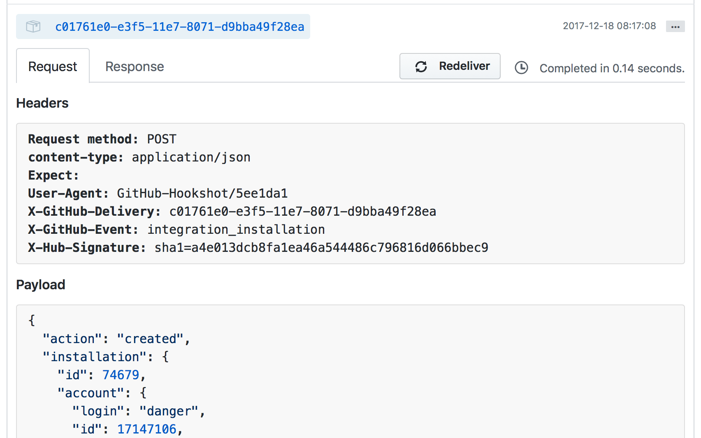

## References

* <https://github.com/danger/peril-settings>
* <https://github.com/artsy/artsy-danger>
* <https://github.com/CocoaPods/peril-settings>

# Config JSON

**@see** - [Introducing Peril to the Artsy Org](http://artsy.github.io/blog/2017/09/04/Introducing-Peril/)

Let's deep dive into the JSON:

```json
{
  "settings": {
    [your settings]
  },
  "rules": {
    "pull_request": "orta/peril-bootstrap@dangerfiles/pr.js",
    "issues": "orta/peril-bootstrap@dangerfiles/issue.js"
  },
  "repos" : {
    "orta/ORStackView": {
      "issue.created": "lock_old_issues.ts"
    }
  }
}
```

### `settings`

**@see** - [source/db/GitHubRepoSettings.ts](https://github.com/danger/peril/master/source/db/GitHubRepoSettings.ts)

I'm hesitatnt to add the specific settings which are supported inside this document, as it'll always end up out of date.

https://github.com/orta/github-webhook-event-types

### `rules`

**@see** - [source/db/index.ts](https://github.com/danger/peril/master/source/db/index.ts)

These are globally applied rules, e.g. to every repo. It's a set of `event names`, to `dangerfiles`.

#### Event Names

These are the names of a webhook from GitHub. A webhook event always has a name, but it may also have an action.

For example, when you set up Peril, you'll have recieved this webhook:



It has an event of `integration_installation` and an action of `created`. The keys in the rules section allow you to
write dangerfiles which only run against either a specific action, or against all of them.

You can get information about _any_ webhook [action/names in the GitHub
docs](https://developer.github.com/v3/activity/events/types/).

For a Pull Request, there are [a lot of
actions](https://developer.github.com/v3/activity/events/types/#pullrequestevent): It can be one of `assigned`,
`unassigned`, `review_requested`, `review_request_removed`, `labeled`, `unlabeled`, `opened`, `edited`, `closed`, or
`reopened`. You can specify a Dangerfile to run either on **all** events by using `"pull_request"` or only a specific
action on a pull request with `"pull_request.[action]"`.

For example:

```json
{
  "rules": {
    "pull_request": "...", // all
    "pull_request.assigned": "...", // only on when a PR has someone assigned
    "pull_request.closed": "...",// only on when a PR is closed
    ...
  }
}
```

### `dangerfiles`

The value in these keys is a reference to a Dangerfile. There are two ways of specifying a Dangerfile, remote or local.

* Remote references are Dangerfiles that do not live on the repo from which the event came.
* Local references come from the same repo as the event.

For Dangerfiles which run on many repos, you probably want to use a remote reference. It would look something like:

* `repo/slug@path/to/dangerfile.js` - _in abstract_
* `artsy/artsy-danger@org/closed-prs.ts`- _in concrete_

For a Dangerfile which exists on the repo your running events from, you can use a local reference

* `path/to/dangerfile.js`

You can also append `#branch` to the end of a string to select a branch to run from.

I'd like to add a way to indicate nullability being OK at some point, e.g. `path/to/dangerfile.js?` - however for now
you will get an error message if the dangerfile does not exist.

### `repos`

Rules are for every repo, `repos` are rules for a single repo.

```json
{
  "rules": {
    "pull_request": "artsy/artsy-danger@org/all-prs.ts",
    "pull_request.closed": "artsy/artsy-danger@org/closed-prs.ts"
  },
  "repos": {
    "artsy/reaction": {
      "pull_request": "danger/pr.ts"
    },
    "artsy/positron": {
      "pull_request": "dangerfile.ts"
    },
  }
```

So, let's say a PR is closed on `artsy/positron`, it would trigger three Dangerfiles to run:

* `"artsy/artsy-danger@org/all-prs.ts"`
* `"artsy/artsy-danger@org/closed-prs.ts"`
* `"danger/pr.ts"` - _this comes from artsy/positron_

If a PR were `edited` or `opened`, it would trigger two dangerfiles:

* `"artsy/artsy-danger@org/all-prs.ts"`
* `"danger/pr.ts"` - _this comes from artsy/positron_

I'm not sure the order in which they're ran, so don't rely on that.

# Writing a Dangerfile

You can write your Dangerfiles in JavaScript or TypeScript. It will be transpiled with these settings:

* [tsconfig.json](https://github.com/danger/peril/blob/master/tsconfig.json)
* [.babelrc](https://github.com/danger/peril/blob/master/.babelrc)

These are not set in stone. You're welcome to improve them.

### Known limitations

* You cannot do a relative import of a JS file
* Async work needs to be `schedule`'d - rather than relying on the node process to handle all async work

# Writing Tests for your Dangerfile

In the Artsy Peril config repo, we runs tests for each new rules in isolation. This is done with a small amount of
trickery. By adding this to the top of your Dangerfile, then making each rule live inside an async `rfc` function.

```ts
const isJest = typeof jest !== "undefined"

// Stores the parameter in a closure that can be invoked in tests.
const storeRFC = (reason: string, closure: () => void | Promise<any>) =>
  // We return a closure here so that the (promise is resolved|closure is invoked)
  // during test time and not when we call rfc().
  () => (closure instanceof Promise ? closure : Promise.resolve(closure()))

// Either schedules the promise for execution via Danger, or invokes closure.
const runRFC = (reason: string, closure: () => void | Promise<any>) =>
  closure instanceof Promise ? schedule(closure) : closure()

const rfc: any = isJest ? storeRFC : runRFC
```

So, a rule to check for a assignee would be something that Jest (which doesn't have the issue around local
import/exports) could import the function.

```js
// https://github.com/artsy/artsy-danger/issues/5
export const rfc5 = rfc("No PR is too small to warrant a paragraph or two of summary", () => {
  const pr = danger.github.pr
  if (pr.body === null || pr.body.length === 0) {
    fail("Please add a description to your PR.")
  }
})
```

Then you can mock `danger` as an import and use any sort of mocked data you want.

```js
jest.mock("danger", () => jest.fn())
import * as danger from "danger"
const dm = danger as any

import { rfc5 } from "../org/all-prs"

beforeEach(() => {
  dm.fail = jest.fn()
})

it("fails when there's no PR body", () => {
  dm.danger = { github: { pr: { body: "" } } }
  return rfc5().then(() => {
    expect(dm.fail).toHaveBeenCalledWith("Please add a description to your PR.")
  })
})

it("does nothing when there's a PR body", () => {
  dm.danger = { github: { pr: { body: "Hello world" } } }
  return rfc5().then(() => {
    expect(dm.fail).not.toHaveBeenCalled()
  })
})
```
